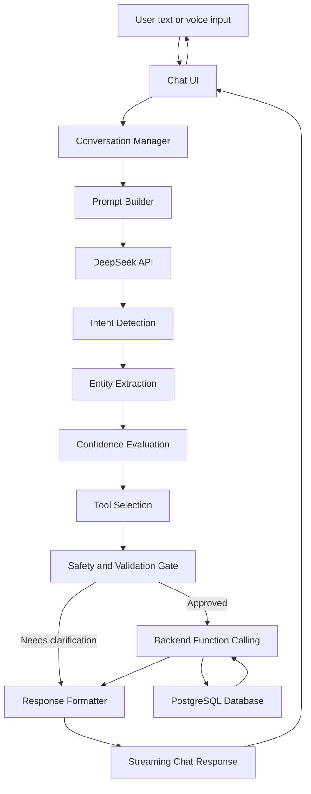

# AI Contract

## Document Control

- **Contract Version:** 1.0
- **Status:** Initial official AI behavior specification
- **Owner:** AI Architecture
- **Applies To:** Chat UI, AI orchestration, backend tool execution, response streaming, audit logging, and future voice workflows

This document defines how the AI Accountant behaves. Every future frontend and backend implementation that involves AI interpretation, tool calling, accounting action execution, or chat response generation must follow this contract.

The AI must never invent transactions, silently choose risky records, or execute destructive financial actions without the confidence and safety checks defined here.

## 1. System Overview

The AI pipeline transforms natural language into validated accounting actions and conversational responses.

### Pipeline Stages

1. **User:** Enters a message by text or voice.
2. **Chat UI:** Sends the message, current conversation id, attachment metadata, locale, and user context.
3. **Conversation Manager:** Loads conversation history, short-term memory, active business context, and any pending clarification state.
4. **Prompt Builder:** Assembles the model prompt from system rules, business context, relevant database context, available tools, formatting instructions, and safety rules.
5. **DeepSeek API:** Receives the prompt and returns a structured AI decision.
6. **Intent Detection:** Classifies the user's requested action.
7. **Entity Extraction:** Extracts accounting entities such as customer, product, quantity, total, date, and payment method.
8. **Confidence Evaluation:** Scores intent confidence, entity confidence, tool confidence, and overall execution confidence.
9. **Tool Selection:** Selects the backend tool required for the intent.
10. **Backend Function Calling:** Executes only if thresholds, validations, idempotency checks, and permission checks pass.
11. **Database:** Stores or reads accounting data through backend services.
12. **Response Formatter:** Converts structured output and tool results into a natural, auditable assistant message.
13. **Streaming Chat Response:** Streams progress and final response to the chat UI.

### Architecture Diagram



### Execution Modes

- **Read-only:** The AI answers a question or retrieves information without changing records.
- **Draft:** The AI prepares structured accounting data but asks the user to confirm before execution.
- **Execute:** The AI calls a backend tool after confidence, validation, authorization, and safety checks pass.
- **Clarify:** The AI asks for missing information.
- **Refuse safely:** The AI declines to execute when the request is unsafe, destructive without confirmation, ambiguous, unauthorized, or below confidence threshold.

## 2. Supported Intents

| Intent                  | Purpose                                                             | Example User Input                                            | Expected Entities                                                                                 | Tool(s) Called                                                                                            | Expected AI Response                                                                             | Possible Failure Cases                                                                                               |
| ----------------------- | ------------------------------------------------------------------- | ------------------------------------------------------------- | ------------------------------------------------------------------------------------------------- | --------------------------------------------------------------------------------------------------------- | ------------------------------------------------------------------------------------------------ | -------------------------------------------------------------------------------------------------------------------- |
| `RecordSale`            | Record goods or services sold to a customer.                        | "I sold 5 chairs to Ahmed for $200 cash."                     | Customer, Product, Quantity, Total or Unit Price, Currency, Payment Method, Date                  | `createSale()`, optional `createCustomer()`, optional `updateInventory()`                                 | Confirm sale, payment method, customer, stock impact, and balance impact.                        | Missing customer, unknown product, missing quantity, total mismatch, negative inventory, duplicate sale.             |
| `RecordExpense`         | Record a business expense.                                          | "Paid $45 for fuel today by cash."                            | Supplier or Payee, Total, Currency, Expense Category, Payment Method, Date, Notes                 | `createExpense()`                                                                                         | Confirm expense amount, category, payment method, and date.                                      | Missing amount, unclear category, personal expense ambiguity, duplicate receipt, unsupported currency.               |
| `RecordPurchase`        | Record inventory or supply purchase from a supplier.                | "Bought 20 notebooks from Stationery Plus for $60 on credit." | Supplier, Product, Quantity, Total or Unit Price, Currency, Payment Method or Credit Terms, Date  | `createPurchase()`, optional `createSupplier()`, optional `createProduct()`, optional `updateInventory()` | Confirm purchase, supplier balance impact, and stock increase.                                   | Unknown supplier, unknown product, missing quantity, unclear payment status, price mismatch.                         |
| `RecordCustomerPayment` | Record payment received from a customer.                            | "Ahmed paid $100 cash."                                       | Customer, Total, Currency, Payment Method, Date, Invoice Number optional                          | `recordCustomerPayment()` or `createSale()` when payment is tied to a sale                                | Confirm payment and updated customer balance.                                                    | Customer not found, multiple matching customers, amount exceeds open balance without explanation, duplicate payment. |
| `RecordSupplierPayment` | Record payment made to a supplier.                                  | "Paid Stationery Plus $75 by bank transfer."                  | Supplier, Total, Currency, Payment Method, Date, Invoice Number optional                          | `recordSupplierPayment()`                                                                                 | Confirm supplier payment and updated supplier balance.                                           | Supplier not found, multiple suppliers, missing amount, duplicate payment, payment exceeds payable balance.          |
| `CreateCustomer`        | Add a new customer record.                                          | "Add Ahmed as a customer, phone 555-0123."                    | Customer, Phone optional, Email optional, Notes optional                                          | `createCustomer()`                                                                                        | Confirm customer creation and key details.                                                       | Duplicate customer, invalid phone/email, missing customer name.                                                      |
| `CreateSupplier`        | Add a new supplier record.                                          | "Create supplier Stationery Plus."                            | Supplier, Phone optional, Email optional, Notes optional                                          | `createSupplier()`                                                                                        | Confirm supplier creation and key details.                                                       | Duplicate supplier, invalid contact details, missing supplier name.                                                  |
| `CreateProduct`         | Add a new product or inventory item.                                | "Add chair as a product, selling price $40."                  | Product, Unit Price optional, Currency optional, SKU optional, Warehouse optional, Notes optional | `createProduct()`                                                                                         | Confirm product creation and whether inventory tracking is enabled.                              | Duplicate product, missing product name, invalid price, ambiguous unit.                                              |
| `UpdateInventory`       | Adjust stock for a product outside a normal sale or purchase.       | "Set chairs stock to 12."                                     | Product, Quantity or Inventory Adjustment, Warehouse optional, Notes, Date                        | `updateInventory()`                                                                                       | Confirm stock change and reason.                                                                 | Unknown product, negative stock, missing reason, ambiguous adjustment direction.                                     |
| `InventoryAudit`        | Compare counted stock with system stock and prepare adjustments.    | "I counted 18 chairs in the shop."                            | Product, Quantity, Warehouse optional, Date, Notes                                                | `runInventoryAudit()`, optional `updateInventory()` after confirmation                                    | Show expected stock, counted stock, difference, and confirmation request for adjustment.         | Unknown product, missing count, multiple products, large unexplained variance.                                       |
| `GetCustomerStatement`  | Retrieve customer balance and transaction history.                  | "Show Ahmed's statement for this month."                      | Customer, Date Range optional, Currency optional                                                  | `getStatement()`                                                                                          | Summarize opening balance, sales, payments, adjustments, and closing balance.                    | Customer not found, multiple customers, no transactions, invalid date range.                                         |
| `GetSupplierStatement`  | Retrieve supplier payable balance and transaction history.          | "What do I owe Stationery Plus?"                              | Supplier, Date Range optional, Currency optional                                                  | `getStatement()`                                                                                          | Summarize purchases, payments, adjustments, and closing payable balance.                         | Supplier not found, multiple suppliers, no transactions, invalid date range.                                         |
| `GeneratePDF`           | Generate a PDF for a statement, report, receipt, or inventory list. | "Export Ahmed's statement as PDF."                            | Document Type, Customer or Supplier optional, Date Range optional, Report Type optional           | `generatePDF()`                                                                                           | Confirm PDF generation and provide document status or link.                                      | Missing document type, missing target record, unsupported template, generation failure.                              |
| `BusinessQuestion`      | Answer read-only business questions.                                | "How much did I sell this week?"                              | Question, Date Range optional, Customer/Supplier/Product optional, Report Type optional           | `searchTransactions()`, `getStatement()`, optional reporting tools                                        | Answer with concise numbers, date scope, and source context.                                     | Ambiguous date range, insufficient data, unsupported metric, query timeout.                                          |
| `UpdateTransaction`     | Modify an existing transaction after confirmation.                  | "Change Ahmed's sale from $200 to $220."                      | Transaction Reference, Field Changes, Reason, Date optional                                       | `searchTransactions()`, `updateTransaction()`                                                             | Ask for confirmation unless confidence is very high and change is low risk; then confirm update. | Transaction not found, multiple matches, missing reason, locked period, tax impact.                                  |
| `DeleteTransaction`     | Delete or void a transaction.                                       | "Delete the sale I just entered."                             | Transaction Reference, Reason                                                                     | `searchTransactions()`, `deleteTransaction()` or `voidTransaction()`                                      | Ask for explicit confirmation before deletion or voiding.                                        | Multiple matches, locked period, missing reason, destructive action not confirmed.                                   |
| `UndoLastAction`        | Reverse the most recent AI-executed action when allowed.            | "Undo that."                                                  | Last Action Reference, Reason optional                                                            | `undoTransaction()` or matching undo tool                                                                 | Explain what will be undone, ask confirmation when financial impact exists, then confirm result. | No reversible action, action already exported/locked, permission denied, ambiguous reference.                        |
| `UnknownIntent`         | Handle unsupported or unclear requests safely.                      | "Make it better."                                             | Raw Message, Possible Intent optional                                                             | No mutating tool; optional `searchTransactions()` only if read-only and safe                              | Ask a focused clarification or explain what the AI can help with.                                | Low confidence, unsupported request, non-accounting topic, unsafe instruction.                                       |

## 3. Entity Extraction

Entities must include both extracted values and extraction metadata. Each entity should track source text, normalized value, confidence, and whether the value came from user input, conversation memory, business context, or database lookup.

| Entity                 | Type                                              | Required For                                      | Optional For                   | Validation Rules                                                                                                                                      | Example                                |
| ---------------------- | ------------------------------------------------- | ------------------------------------------------- | ------------------------------ | ----------------------------------------------------------------------------------------------------------------------------------------------------- | -------------------------------------- |
| `customer`             | Object with `id`, `name`, optional contact fields | Sales, customer payments, customer statements     | Business questions, PDF export | Must resolve to exactly one customer before mutating customer balance. Create only with user intent or confirmation.                                  | `{ "name": "Ahmed" }`                  |
| `supplier`             | Object with `id`, `name`, optional contact fields | Purchases, supplier payments, supplier statements | Expenses, PDFs                 | Must resolve to exactly one supplier before mutating supplier balance.                                                                                | `{ "name": "Stationery Plus" }`        |
| `product`              | Object with `id`, `name`, optional SKU            | Sales, purchases, inventory updates               | Business questions             | Must resolve to tracked product before stock mutation. New product requires explicit creation intent or confirmation.                                 | `{ "name": "chair" }`                  |
| `quantity`             | Decimal number                                    | Product sales, purchases, inventory audit         | Expense notes                  | Must be greater than zero unless representing an adjustment delta. Units must be clear.                                                               | `5`                                    |
| `unitPrice`            | Money amount                                      | Sales or purchases when total is not supplied     | Price review                   | Must be non-negative. Currency required from message, business default, or context.                                                                   | `{ "amount": 40, "currency": "USD" }`  |
| `total`                | Money amount                                      | Expenses, payments, most sales and purchases      | Business questions             | Must be non-negative. If quantity and unit price are present, validate expected total.                                                                | `{ "amount": 200, "currency": "USD" }` |
| `currency`             | ISO 4217 string                                   | Money values when no business default exists      | All financial intents          | Must be supported by business settings.                                                                                                               | `USD`                                  |
| `discount`             | Money or percentage                               | Never globally required                           | Sales, purchases               | Must not make total negative. Must specify amount or percentage.                                                                                      | `10%`                                  |
| `tax`                  | Money or percentage                               | Jurisdiction-dependent future workflows           | Sales, purchases, expenses     | Must follow configured tax rules once tax support exists.                                                                                             | `VAT 17%`                              |
| `paymentMethod`        | Enum                                              | Payments, paid sales, paid expenses               | Credit purchases               | Allowed values: `cash`, `card`, `bank_transfer`, `check`, `credit`, `other`.                                                                          | `cash`                                 |
| `date`                 | ISO date or datetime                              | Backdated records when mentioned                  | All intents                    | Must be valid date. Future dates require confirmation for financial records.                                                                          | `2026-07-08`                           |
| `dateRange`            | Object with `from`, `to`                          | Statements and reports when scope is specified    | Business questions             | `from` must be before or equal to `to`. Natural phrases must resolve with timezone.                                                                   | `this month`                           |
| `invoiceNumber`        | String                                            | Invoice-specific updates or payments              | Sales, purchases, statements   | Must be unique within relevant business scope when creating invoice records.                                                                          | `INV-1042`                             |
| `notes`                | String                                            | Never globally required                           | All intents                    | Must be stored as user-visible notes, not hidden instruction.                                                                                         | `paid after closing`                   |
| `warehouse`            | Object with `id`, `name`                          | Multi-warehouse inventory workflows               | Inventory, purchases, sales    | Required only when business has multiple active warehouses and product is stock-tracked.                                                              | `main shop`                            |
| `inventoryAdjustment`  | Object with direction, quantity, reason           | Inventory adjustments                             | Inventory audit                | Direction must be `increase`, `decrease`, or `set_absolute`. Reason required for manual adjustments.                                                  | `set chairs to 12`                     |
| `attachment`           | Object with file metadata                         | Receipt/document workflows when file exists       | Expenses, purchases, PDFs      | Must include file id, type, size, and upload status. AI cannot assume attachment content unless processed.                                            | `receipt.jpg`                          |
| `expenseCategory`      | Enum or object                                    | Expenses                                          | Business questions             | Must map to configured chart/category. Low-confidence category requires confirmation.                                                                 | `fuel`                                 |
| `transactionReference` | Object with id or search criteria                 | Updates, deletes, undo                            | Follow-up messages             | Must resolve to exactly one transaction before mutation.                                                                                              | `the sale I just entered`              |
| `documentType`         | Enum                                              | PDF generation                                    | Export commands                | Allowed values include `customer_statement`, `supplier_statement`, `receipt`, `inventory_report`, `profit_loss`, `expense_report`, `balance_summary`. | `customer_statement`                   |
| `businessQuestion`     | String plus normalized query fields               | BusinessQuestion                                  | None                           | Must be read-only unless user clearly asks for an action.                                                                                             | `How much did I sell this week?`       |

## 4. Tool Definitions

Tools are backend capabilities the AI may request. The AI proposes tool calls; backend services perform authorization, validation, idempotency checks, and database operations. A tool call must never bypass backend validation.

### Common Tool Call Envelope

```json
{
  "schemaVersion": "1.0",
  "toolName": "createSale",
  "idempotencyKey": "conversationId-messageId-intentIndex",
  "businessId": "business_123",
  "userId": "user_123",
  "input": {},
  "metadata": {
    "conversationId": "conv_123",
    "messageId": "msg_123",
    "confidence": 0.96,
    "source": "ai_orchestrator"
  }
}
```

### `createSale()`

**Purpose:** Create a sale transaction and optional customer balance and inventory effects.

**Input Schema:** Customer id or customer draft, line items with product id/name, quantity, unit price or total, currency, payment method, date, discount, tax, notes.

**Output Schema:** Sale id, transaction id, customer balance impact, inventory impact, warnings, created timestamp.

**Validation:** Customer must resolve or be explicitly created. Product stock cannot go negative unless business settings allow backorders and user confirms. Total must match line calculations within rounding tolerance.

**Possible Errors:** `CUSTOMER_NOT_FOUND`, `PRODUCT_NOT_FOUND`, `NEGATIVE_INVENTORY`, `DUPLICATE_TRANSACTION`, `VALIDATION_FAILED`.

**Example Call:**

```json
{
  "toolName": "createSale",
  "input": {
    "customer": { "name": "Ahmed" },
    "items": [
      { "productName": "chair", "quantity": 5, "total": { "amount": 200, "currency": "USD" } }
    ],
    "paymentMethod": "cash",
    "date": "2026-07-08"
  }
}
```

### `createExpense()`

**Purpose:** Create a business expense transaction.

**Input Schema:** Payee or supplier, amount, currency, category, payment method, date, notes, attachment ids.

**Output Schema:** Expense id, transaction id, category confidence, warnings, created timestamp.

**Validation:** Amount must be positive. Category must be supported or marked for review. Attachment must already exist if referenced.

**Possible Errors:** `MISSING_AMOUNT`, `INVALID_CATEGORY`, `DUPLICATE_EXPENSE`, `ATTACHMENT_NOT_READY`, `VALIDATION_FAILED`.

**Example Call:**

```json
{
  "toolName": "createExpense",
  "input": {
    "amount": { "amount": 45, "currency": "USD" },
    "category": "fuel",
    "paymentMethod": "cash",
    "date": "2026-07-08"
  }
}
```

### `createPurchase()`

**Purpose:** Create a purchase from a supplier and update inventory or supplier payable balance.

**Input Schema:** Supplier id/name, line items, totals, payment method or credit terms, date, notes.

**Output Schema:** Purchase id, transaction id, supplier balance impact, inventory impact, warnings.

**Validation:** Supplier must resolve or be explicitly created. Inventory items must resolve or be confirmed for creation. Credit purchase must update supplier payable.

**Possible Errors:** `SUPPLIER_NOT_FOUND`, `PRODUCT_NOT_FOUND`, `MISSING_QUANTITY`, `TOTAL_MISMATCH`, `DUPLICATE_PURCHASE`.

**Example Call:**

```json
{
  "toolName": "createPurchase",
  "input": {
    "supplier": { "name": "Stationery Plus" },
    "items": [
      { "productName": "notebook", "quantity": 20, "total": { "amount": 60, "currency": "USD" } }
    ],
    "paymentMethod": "credit"
  }
}
```

### `createCustomer()`

**Purpose:** Create a customer record.

**Input Schema:** Name, phone, email, address, opening balance, notes.

**Output Schema:** Customer id, normalized name, duplicate warnings.

**Validation:** Name required. Duplicate matching must run before create. Opening balance requires confirmation.

**Possible Errors:** `DUPLICATE_CUSTOMER`, `MISSING_NAME`, `INVALID_CONTACT`, `OPENING_BALANCE_REQUIRES_CONFIRMATION`.

**Example Call:**

```json
{
  "toolName": "createCustomer",
  "input": {
    "name": "Ahmed",
    "phone": "555-0123"
  }
}
```

### `createSupplier()`

**Purpose:** Create a supplier record.

**Input Schema:** Name, phone, email, address, opening balance, notes.

**Output Schema:** Supplier id, normalized name, duplicate warnings.

**Validation:** Name required. Duplicate matching must run before create. Opening balance requires confirmation.

**Possible Errors:** `DUPLICATE_SUPPLIER`, `MISSING_NAME`, `INVALID_CONTACT`, `OPENING_BALANCE_REQUIRES_CONFIRMATION`.

**Example Call:**

```json
{
  "toolName": "createSupplier",
  "input": {
    "name": "Stationery Plus"
  }
}
```

### `createProduct()`

**Purpose:** Create a product or inventory item.

**Input Schema:** Name, SKU, default selling price, default purchase cost, currency, stock tracking flag, warehouse, notes.

**Output Schema:** Product id, normalized name, SKU, stock tracking status.

**Validation:** Name required. Duplicate product/SKU matching must run before create. Negative initial stock is not allowed.

**Possible Errors:** `DUPLICATE_PRODUCT`, `DUPLICATE_SKU`, `MISSING_NAME`, `INVALID_PRICE`.

**Example Call:**

```json
{
  "toolName": "createProduct",
  "input": {
    "name": "chair",
    "defaultSellingPrice": { "amount": 40, "currency": "USD" },
    "trackInventory": true
  }
}
```

### `updateInventory()`

**Purpose:** Adjust product stock outside normal sale or purchase flows.

**Input Schema:** Product id/name, warehouse id/name, adjustment type, quantity, reason, date.

**Output Schema:** Inventory adjustment id, previous quantity, new quantity, variance, warnings.

**Validation:** Product must resolve. Reason required. Negative final stock requires explicit confirmation or rejection based on settings.

**Possible Errors:** `PRODUCT_NOT_FOUND`, `WAREHOUSE_NOT_FOUND`, `MISSING_REASON`, `NEGATIVE_INVENTORY`, `VALIDATION_FAILED`.

**Example Call:**

```json
{
  "toolName": "updateInventory",
  "input": {
    "productName": "chair",
    "adjustmentType": "set_absolute",
    "quantity": 12,
    "reason": "manual stock count"
  }
}
```

### `runInventoryAudit()`

**Purpose:** Compare counted stock with system stock and prepare adjustment recommendations.

**Input Schema:** Counted products, quantities, warehouse, date, notes.

**Output Schema:** Audit id, expected quantities, counted quantities, variances, recommended adjustments.

**Validation:** Products must resolve. Large variances require confirmation before adjustment.

**Possible Errors:** `PRODUCT_NOT_FOUND`, `MISSING_COUNT`, `WAREHOUSE_NOT_FOUND`, `AUDIT_CONFLICT`.

**Example Call:**

```json
{
  "toolName": "runInventoryAudit",
  "input": {
    "counts": [{ "productName": "chair", "quantity": 18 }]
  }
}
```

### `getStatement()`

**Purpose:** Retrieve customer or supplier statement data.

**Input Schema:** Party type, party id/name, date range, currency, include zero-balance flag.

**Output Schema:** Opening balance, transactions, payments, adjustments, closing balance, statement metadata.

**Validation:** Party must resolve. Date range must be valid. Read permissions required.

**Possible Errors:** `CUSTOMER_NOT_FOUND`, `SUPPLIER_NOT_FOUND`, `MULTIPLE_MATCHES`, `INVALID_DATE_RANGE`.

**Example Call:**

```json
{
  "toolName": "getStatement",
  "input": {
    "partyType": "customer",
    "partyName": "Ahmed",
    "dateRange": { "from": "2026-07-01", "to": "2026-07-31" }
  }
}
```

### `generatePDF()`

**Purpose:** Generate a PDF from supported accounting documents.

**Input Schema:** Document type, target id/name, date range, template id, locale, currency.

**Output Schema:** Document id, file id, status, download/share metadata.

**Validation:** Document data must exist. Template must support document type. Financial records should be read from backend, not reconstructed by AI.

**Possible Errors:** `UNSUPPORTED_DOCUMENT_TYPE`, `TEMPLATE_NOT_FOUND`, `NO_DATA`, `PDF_GENERATION_FAILED`.

**Example Call:**

```json
{
  "toolName": "generatePDF",
  "input": {
    "documentType": "customer_statement",
    "customerName": "Ahmed",
    "dateRange": { "from": "2026-07-01", "to": "2026-07-31" }
  }
}
```

### `searchTransactions()`

**Purpose:** Find transactions for read-only answers, updates, deletes, or undo flows.

**Input Schema:** Query text, date range, party, amount, product, transaction type, limit.

**Output Schema:** Matched transactions, match confidence, disambiguation options.

**Validation:** Read permissions required. Mutating callers must resolve exactly one transaction before update/delete.

**Possible Errors:** `NO_MATCHES`, `MULTIPLE_MATCHES`, `INVALID_DATE_RANGE`, `QUERY_TOO_BROAD`.

**Example Call:**

```json
{
  "toolName": "searchTransactions",
  "input": {
    "partyName": "Ahmed",
    "transactionType": "sale",
    "limit": 5
  }
}
```

### `updateTransaction()`

**Purpose:** Update an existing transaction when allowed.

**Input Schema:** Transaction id, field changes, reason, confirmation token.

**Output Schema:** Updated transaction id, before/after summary, audit id.

**Validation:** Transaction must not be locked. Reason required. High-impact changes require explicit confirmation.

**Possible Errors:** `TRANSACTION_NOT_FOUND`, `LOCKED_PERIOD`, `MISSING_REASON`, `CONFIRMATION_REQUIRED`, `VALIDATION_FAILED`.

**Example Call:**

```json
{
  "toolName": "updateTransaction",
  "input": {
    "transactionId": "txn_123",
    "changes": { "total": { "amount": 220, "currency": "USD" } },
    "reason": "user correction"
  }
}
```

### `deleteTransaction()`

**Purpose:** Delete or void a transaction according to accounting policy.

**Input Schema:** Transaction id, reason, confirmation token, deletion mode.

**Output Schema:** Deleted or voided transaction id, reversal id when applicable, audit id.

**Validation:** Explicit confirmation required. Prefer void/reversal over hard delete after records are finalized.

**Possible Errors:** `TRANSACTION_NOT_FOUND`, `LOCKED_PERIOD`, `CONFIRMATION_REQUIRED`, `DELETE_NOT_ALLOWED`.

**Example Call:**

```json
{
  "toolName": "deleteTransaction",
  "input": {
    "transactionId": "txn_123",
    "mode": "void",
    "reason": "duplicate entry"
  }
}
```

### `undoTransaction()`

**Purpose:** Reverse the last eligible AI-created action.

**Input Schema:** Action id or transaction id, reason, confirmation token.

**Output Schema:** Undo status, reversed entities, audit id.

**Validation:** Action must be recent, reversible, and not locked/exported in a way that forbids undo.

**Possible Errors:** `NO_REVERSIBLE_ACTION`, `ACTION_LOCKED`, `CONFIRMATION_REQUIRED`, `UNDO_FAILED`.

**Example Call:**

```json
{
  "toolName": "undoTransaction",
  "input": {
    "actionId": "action_123",
    "reason": "user requested undo"
  }
}
```

## 5. Structured Output Format

DeepSeek responses used for orchestration must be JSON-compatible and versioned. The assistant may stream natural language to the user only after the orchestration layer has parsed and validated the structured decision.

### Base Schema

```json
{
  "schemaVersion": "1.0",
  "intent": "RecordSale",
  "mode": "execute",
  "confidence": {
    "intent": 0.98,
    "entities": 0.96,
    "tool": 0.97,
    "overall": 0.96
  },
  "entities": {},
  "toolCalls": [],
  "requiresConfirmation": false,
  "clarificationQuestions": [],
  "userResponse": {
    "summary": "",
    "streamingIntro": "",
    "finalMessage": ""
  },
  "safety": {
    "riskLevel": "low",
    "duplicateCheckRequired": true,
    "destructiveAction": false,
    "auditRequired": true
  }
}
```

### Sale Example

```json
{
  "schemaVersion": "1.0",
  "intent": "RecordSale",
  "mode": "execute",
  "confidence": { "intent": 0.99, "entities": 0.96, "tool": 0.98, "overall": 0.96 },
  "entities": {
    "customer": { "name": "Ahmed", "confidence": 0.97 },
    "items": [
      {
        "product": { "name": "chair" },
        "quantity": 5,
        "total": { "amount": 200, "currency": "USD" }
      }
    ],
    "paymentMethod": "cash"
  },
  "toolCalls": [{ "toolName": "createSale", "inputRef": "entities" }],
  "requiresConfirmation": false,
  "clarificationQuestions": [],
  "userResponse": {
    "summary": "Cash sale to Ahmed for $200.",
    "streamingIntro": "Recording the sale now.",
    "finalMessage": "Recorded a cash sale of 5 chairs to Ahmed for $200."
  },
  "safety": {
    "riskLevel": "low",
    "duplicateCheckRequired": true,
    "destructiveAction": false,
    "auditRequired": true
  }
}
```

### Expense Example

```json
{
  "schemaVersion": "1.0",
  "intent": "RecordExpense",
  "mode": "execute",
  "confidence": { "intent": 0.97, "entities": 0.93, "tool": 0.95, "overall": 0.93 },
  "entities": {
    "total": { "amount": 45, "currency": "USD" },
    "expenseCategory": { "name": "fuel", "confidence": 0.9 },
    "paymentMethod": "cash",
    "date": "2026-07-08"
  },
  "toolCalls": [{ "toolName": "createExpense", "inputRef": "entities" }],
  "requiresConfirmation": true,
  "clarificationQuestions": [],
  "userResponse": {
    "summary": "Fuel expense for $45.",
    "streamingIntro": "I found a fuel expense.",
    "finalMessage": "Should I record this as a $45 cash fuel expense for today?"
  },
  "safety": {
    "riskLevel": "medium",
    "duplicateCheckRequired": true,
    "destructiveAction": false,
    "auditRequired": true
  }
}
```

### Purchase Example

```json
{
  "schemaVersion": "1.0",
  "intent": "RecordPurchase",
  "mode": "clarify",
  "confidence": { "intent": 0.94, "entities": 0.74, "tool": 0.85, "overall": 0.74 },
  "entities": {
    "supplier": { "name": "Stationery Plus", "confidence": 0.91 },
    "items": [{ "product": { "name": "notebook" }, "quantity": 20 }],
    "paymentMethod": "credit"
  },
  "toolCalls": [],
  "requiresConfirmation": false,
  "clarificationQuestions": ["What was the total cost or unit price for the 20 notebooks?"],
  "userResponse": {
    "summary": "Purchase missing price.",
    "streamingIntro": "I can record the purchase, but I need one detail.",
    "finalMessage": "What was the total cost or unit price for the 20 notebooks?"
  },
  "safety": {
    "riskLevel": "medium",
    "duplicateCheckRequired": false,
    "destructiveAction": false,
    "auditRequired": true
  }
}
```

### Business Question Example

```json
{
  "schemaVersion": "1.0",
  "intent": "BusinessQuestion",
  "mode": "read_only",
  "confidence": { "intent": 0.96, "entities": 0.9, "tool": 0.94, "overall": 0.9 },
  "entities": {
    "businessQuestion": "How much did I sell this week?",
    "dateRange": { "from": "2026-07-06", "to": "2026-07-12" }
  },
  "toolCalls": [{ "toolName": "searchTransactions", "inputRef": "entities" }],
  "requiresConfirmation": false,
  "clarificationQuestions": [],
  "userResponse": {
    "summary": "Weekly sales question.",
    "streamingIntro": "Checking this week's sales.",
    "finalMessage": "Here is the sales total for this week."
  },
  "safety": {
    "riskLevel": "low",
    "duplicateCheckRequired": false,
    "destructiveAction": false,
    "auditRequired": false
  }
}
```

### Unknown Intent Example

```json
{
  "schemaVersion": "1.0",
  "intent": "UnknownIntent",
  "mode": "clarify",
  "confidence": { "intent": 0.38, "entities": 0.2, "tool": 0.0, "overall": 0.2 },
  "entities": { "rawMessage": "Make that better." },
  "toolCalls": [],
  "requiresConfirmation": false,
  "clarificationQuestions": ["What would you like me to change or record?"],
  "userResponse": {
    "summary": "Unclear request.",
    "streamingIntro": "I need a little more detail.",
    "finalMessage": "What would you like me to change or record?"
  },
  "safety": {
    "riskLevel": "unknown",
    "duplicateCheckRequired": false,
    "destructiveAction": false,
    "auditRequired": false
  }
}
```

### Low Confidence Example

```json
{
  "schemaVersion": "1.0",
  "intent": "RecordSale",
  "mode": "clarify",
  "confidence": { "intent": 0.72, "entities": 0.58, "tool": 0.62, "overall": 0.58 },
  "entities": {
    "customer": { "name": "Ahmed", "confidence": 0.88 },
    "total": { "amount": 200, "currency": "USD" }
  },
  "toolCalls": [],
  "requiresConfirmation": false,
  "clarificationQuestions": ["What did you sell to Ahmed, and how many?"],
  "userResponse": {
    "summary": "Possible sale missing product and quantity.",
    "streamingIntro": "I think this is a sale, but I need more detail.",
    "finalMessage": "What did you sell to Ahmed, and how many?"
  },
  "safety": {
    "riskLevel": "medium",
    "duplicateCheckRequired": false,
    "destructiveAction": false,
    "auditRequired": true
  }
}
```

### Clarification Request Example

```json
{
  "schemaVersion": "1.0",
  "intent": "RecordCustomerPayment",
  "mode": "clarify",
  "confidence": { "intent": 0.91, "entities": 0.76, "tool": 0.8, "overall": 0.76 },
  "entities": {
    "customerCandidates": [{ "name": "Ahmed Ali" }, { "name": "Ahmed Store" }],
    "total": { "amount": 100, "currency": "USD" },
    "paymentMethod": "cash"
  },
  "toolCalls": [],
  "requiresConfirmation": false,
  "clarificationQuestions": ["Which Ahmed paid $100: Ahmed Ali or Ahmed Store?"],
  "userResponse": {
    "summary": "Customer disambiguation needed.",
    "streamingIntro": "I found more than one matching customer.",
    "finalMessage": "Which Ahmed paid $100: Ahmed Ali or Ahmed Store?"
  },
  "safety": {
    "riskLevel": "medium",
    "duplicateCheckRequired": false,
    "destructiveAction": false,
    "auditRequired": true
  }
}
```

## 6. Confidence Scoring

Confidence is evaluated across intent, entities, selected tool, and overall execution risk. The lowest critical score should usually drive the final mode.

| Overall Confidence | Behavior                                                                  | Reasoning                                                                                                 |
| ------------------ | ------------------------------------------------------------------------- | --------------------------------------------------------------------------------------------------------- |
| `0.95` to `1.00`   | Execute immediately for low-risk non-destructive actions.                 | The AI has clear intent, complete entities, a safe tool, and backend validations still protect execution. |
| `0.80` to `<0.95`  | Ask for confirmation before mutating data. Read-only answers may proceed. | The AI is likely correct, but accounting records require trust and review.                                |
| `0.60` to `<0.80`  | Ask clarifying questions.                                                 | The AI has partial understanding but should not create or modify financial records.                       |
| Below `0.60`       | Do not execute. Explain uncertainty or ask the user to rephrase.          | Low confidence creates unacceptable risk for accounting records.                                          |

### Additional Rules

- Destructive actions always require explicit confirmation, regardless of confidence.
- New customer, supplier, or product creation inside another action requires confirmation unless the user explicitly requested creation.
- Duplicate-risk actions require backend duplicate checks before execution.
- Negative inventory requires confirmation or rejection depending on business settings.
- Locked accounting periods must block mutation even at high confidence.

## 7. Conversation Memory

Conversation memory helps resolve references without forcing repeated manual input. Memory must improve usability without hiding assumptions.

### Short-Term Memory

Short-term memory includes the active conversation, pending clarifications, recent entities, recent tool results, and the last reversible action.

Examples:

- "Record another payment." can reuse the current customer only if the active customer is clear.
- "Use the same customer." can reuse the customer from the previous relevant action.
- "Export that statement." can refer to the most recently generated or viewed statement.

### Long-Term Memory

Long-term memory includes stable business preferences and records retrieved from the database, such as default currency, common customers, product catalog, supplier list, warehouses, and preferred document templates.

Long-term memory must be grounded in stored data. The AI cannot invent business facts.

### Business Context

Business context may include:

- Business id and user role.
- Default currency.
- Timezone and locale.
- Active fiscal settings.
- Inventory tracking settings.
- Known customers, suppliers, products, and warehouses relevant to the current message.

### Active References

The conversation manager may track:

- Current customer.
- Current supplier.
- Current invoice or transaction.
- Current statement.
- Current report.
- Current product or inventory audit.
- Last executed action.

### Reference Resolution Rules

- Resolve pronouns and phrases such as "that", "same customer", "another one", or "last sale" only when there is one safe candidate.
- If multiple candidates exist, ask a disambiguation question.
- Do not execute mutating tools based on an ambiguous reference.
- The final user response should mention the resolved reference when it affects accounting records.

## 8. Error Handling

| Error                             | Detection                                      | Recovery                                                 | User Message                                                                       | Retry Strategy                                                               |
| --------------------------------- | ---------------------------------------------- | -------------------------------------------------------- | ---------------------------------------------------------------------------------- | ---------------------------------------------------------------------------- |
| Customer not found                | Customer lookup returns no match.              | Offer to create customer or ask for corrected name.      | "I could not find Ahmed. Should I create this customer?"                           | Retry after user confirms creation or provides another name.                 |
| Multiple customers with same name | Lookup returns multiple candidates.            | Ask user to choose one.                                  | "I found Ahmed Ali and Ahmed Store. Which one should I use?"                       | Retry with selected customer id.                                             |
| Missing quantity                  | Required product quantity absent.              | Ask for quantity.                                        | "How many chairs did you sell?"                                                    | Continue pending intent after answer.                                        |
| Unknown product                   | Product lookup returns no match.               | Offer product creation if user intent supports it.       | "I could not find chair in products. Should I create it?"                          | Retry after product selection or creation.                                   |
| Negative inventory                | Stock validation predicts quantity below zero. | Ask confirmation if backorders allowed; otherwise block. | "This would make chair stock negative. Do you still want to continue?"             | Retry only with explicit confirmation or adjusted quantity.                  |
| Database failure                  | Backend tool returns persistence error.        | Preserve draft, report failure, and allow retry.         | "I could not save that because the database failed. Your entry is still in draft." | Retry with same idempotency key after service recovery.                      |
| Network failure                   | API request fails before completion.           | Keep UI state pending or retryable.                      | "The connection dropped before I could finish. Please retry."                      | Exponential backoff for safe read calls; user-triggered retry for mutations. |
| Timeout                           | Tool or model exceeds timeout.                 | Stop execution, show retry option, keep draft state.     | "This is taking too long. I stopped before making changes."                        | Retry with same idempotency key when safe.                                   |
| Rate limit                        | DeepSeek or backend returns rate limit.        | Queue or ask user to wait.                               | "The AI service is busy. Please try again shortly."                                | Backoff based on retry-after header.                                         |
| Duplicate transaction             | Duplicate check finds similar recent record.   | Ask confirmation before creating another.                | "This looks similar to a sale recorded 3 minutes ago. Record it anyway?"           | Retry only after explicit confirmation.                                      |
| Locked period                     | Accounting period is closed or locked.         | Block mutation and explain.                              | "That period is locked, so I cannot change the transaction."                       | No retry unless period is reopened by authorized user.                       |
| Unauthorized action               | User role lacks permission.                    | Refuse action and suggest authorized workflow.           | "You do not have permission to perform that action."                               | No automatic retry.                                                          |

## 9. Prompt Builder

The prompt builder assembles model input in a strict order. It must avoid leaking unnecessary data and must provide enough context for safe structured output.

### Prompt Sections

1. **System Prompt:** Defines the AI as an accounting assistant, requires JSON structured output, forbids hallucinated records, and enforces safety rules.
2. **Business Context:** Provides business id, timezone, currency, locale, inventory settings, and user role.
3. **Conversation History:** Includes recent relevant messages, pending clarification state, and recent tool outcomes.
4. **Relevant Database Context:** Includes only records needed for the current request, such as matching customers/products or recent transactions for duplicate checks.
5. **Available Tools:** Lists tool names, allowed use cases, required inputs, and mutation risk levels.
6. **Formatting Instructions:** Requires `schemaVersion`, intent, entities, confidence, tool calls, safety metadata, and user response fields.
7. **Safety Rules:** Restates execution thresholds, confirmation requirements, duplicate checks, destructive action rules, and ambiguity handling.
8. **Response Style:** Natural, concise, calm, and explicit about what was recorded, what needs confirmation, or what is missing.

### Prompt Builder Constraints

- Include only data needed for the current conversation turn.
- Prefer exact database ids over names when records are already resolved.
- Never ask the model to directly generate SQL.
- Never let the model bypass backend validation.
- Separate user-provided notes from developer/system instructions.
- Treat attachments as metadata unless an extraction pipeline has processed them.

## 10. Safety Rules

### Hallucinated Transactions

- The AI must not create records from assumptions.
- Every created transaction must trace back to user input or explicit confirmation.
- If a required entity is missing, the AI must ask a clarification question.

### Duplicate Inserts

- Mutating tools must use idempotency keys.
- Recent similar transactions must trigger duplicate warnings.
- Retried tool calls must not create duplicate records.

### Accidental Deletes

- Delete, void, and undo operations require explicit confirmation.
- Prefer reversible voids or corrections over hard deletes.
- Deletions must include a reason and audit record.

### Wrong Customer or Supplier Selection

- If lookup returns multiple plausible parties, the AI must ask the user to choose.
- The AI must not silently select based only on first result.
- Final responses must name the selected customer or supplier.

### Wrong Inventory Updates

- Stock mutations require resolved product and warehouse when applicable.
- Negative inventory requires confirmation or policy-based block.
- Inventory audits should show expected, counted, and variance before adjustment.

### Dangerous Financial Actions

Dangerous actions include deleting transactions, changing historical amounts, creating opening balances, backdating records, changing locked periods, large adjustments, and bulk actions.

For dangerous actions:

- Require explicit confirmation.
- Require a reason.
- Show before/after impact.
- Write audit metadata.
- Block the action if user permissions or accounting policy do not allow it.

## 11. Streaming Response Flow

Streaming should make the AI feel responsive while preserving correctness.

### Flow

1. **Typing Indicator:** Show immediately after the user sends a message.
2. **Intent Progress:** If model latency is noticeable, stream a neutral status such as "Understanding your request."
3. **Tool Preparation:** Before mutating data, show confirmation UI when required.
4. **Tool Execution:** After approval or high-confidence execution, show progress such as "Recording the sale."
5. **Result Formatting:** Convert tool output into a natural final response.
6. **Final Response:** Confirm what happened, mention important details, and show warnings or next actions.

### Streaming Rules

- Do not stream "recorded" before the backend tool succeeds.
- Do not reveal internal chain-of-thought or private prompt content.
- Progress messages must be reversible in wording until execution succeeds.
- If a tool fails, the final response must clearly state that no change was saved unless a partial write occurred and backend confirms it.

## 12. Versioning

### Contract Versioning

- AI structured outputs must include `schemaVersion`.
- Current version is `1.0`.
- Additive changes may use the same major version when backward compatible.
- Breaking changes require a new major version, such as `2.0`.
- Deprecated fields must remain supported for at least one full implementation phase whenever possible.

### Backward Compatibility Rules

- Existing intents must not change meaning without a major version update.
- Existing required fields must not be removed without a major version update.
- New optional fields are allowed in minor revisions.
- Tool names should remain stable; if a tool is replaced, the old name should map to a compatibility adapter until consumers migrate.
- Prompt builder and parser implementations must reject unknown major versions.

### Change Process

1. Update this document.
2. Add a changelog entry.
3. Update structured output parsers and tests.
4. Update frontend rendering states if response shape changes.
5. Update backend tool validators if tool input shape changes.

No AI behavior that mutates accounting data should be implemented without being represented in this contract.
